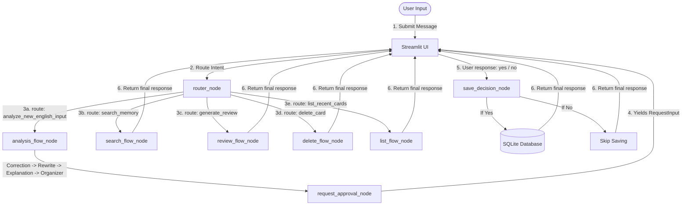

# Architecture Design

This document details the architectural design and system workflows of the **English Memory Agent** updated for **ADK 2.0**.

## System Coordination Overview

The project integrates three major components into a unified desktop learning assistant:

1. **Streamlit UI**: Serves as the user-facing web dashboard (offering tabs for analysis, search, review, and library overview).
2. **Google ADK 2.0 (Agent Development Kit)**: Orchestrates the graph-based multi-agent execution pipeline (using the `Workflow` class).
3. **SQLite Database**: Manages local data persistence for saved memory cards using standard SQL operations.

---

## Workflow Diagram (Mermaid)

The diagram below maps the ADK 2.0 graph routes from initial user query down to tool execution and local DB persistence:



---

## Graph Edges Configuration

The workflow graph is declared explicitly in `english_memory_agent/agent.py` using sequential and branching edges:

```python
root_agent = Workflow(
    name="root_agent",
    edges=[
        ("START", router_node),
        (router_node, {
            "analyze_new_english_input": analysis_flow_node,
            "search_memory": search_flow_node,
            "generate_review": review_flow_node,
            "delete_card": delete_flow_node,
            "list_recent_cards": list_flow_node
        }),
        (analysis_flow_node, request_approval_node),
        (request_approval_node, save_decision_node)
    ]
)
```

---

## ADK 2.0 Nodes & Sub-Agents

1. **`router_node`**: Runs `router_agent` to extract the user's intent, keywords, and card IDs, storing them in context state (`ctx.state`).
2. **`analysis_flow_node`**: Orchestrates `correction_agent`, `rewrite_agent`, `explanation_agent`, and `organizer_agent` to generate and package the card dictionary. Runs the local `privacy_scan` check.
3. **`request_approval_node`**: Checks the privacy scan result. If unsafe, it yields `"blocked"`. If safe, it yields a `RequestInput` object to pause the workflow, requesting human confirmation before saving.
4. **`save_decision_node`**: Receives the user's input (`"yes"` or `"no"`). Saves the card using the SQLite `save_card` tool if confirmed, or skips it if denied.
5. **`search_flow_node`**: Runs the SQLite search tool on the query keyword.
6. **`review_flow_node`**: Generates review quiz questions from the most recent card entries.
7. **`delete_flow_node`**: Deletes a specific card by its database ID.
8. **`list_flow_node`**: Retrieves the 10 most recently saved cards.

---

## Component Integration

- **Streamlit**: Runs the asynchronous event loop using the ADK 2.0 `Runner`. When a `RequestInput` event is encountered, it captures the payload and displays the "Confirm Save" button, resuming the workflow when the user selects an option.
- **Google ADK 2.0**: Declares the workflow graph, session states, and telemetry. It integrates with Gemini model API to run structured JSON extraction.
- **SQLite**: Relational database located under `english_memory_agent/database/memory.db`.
